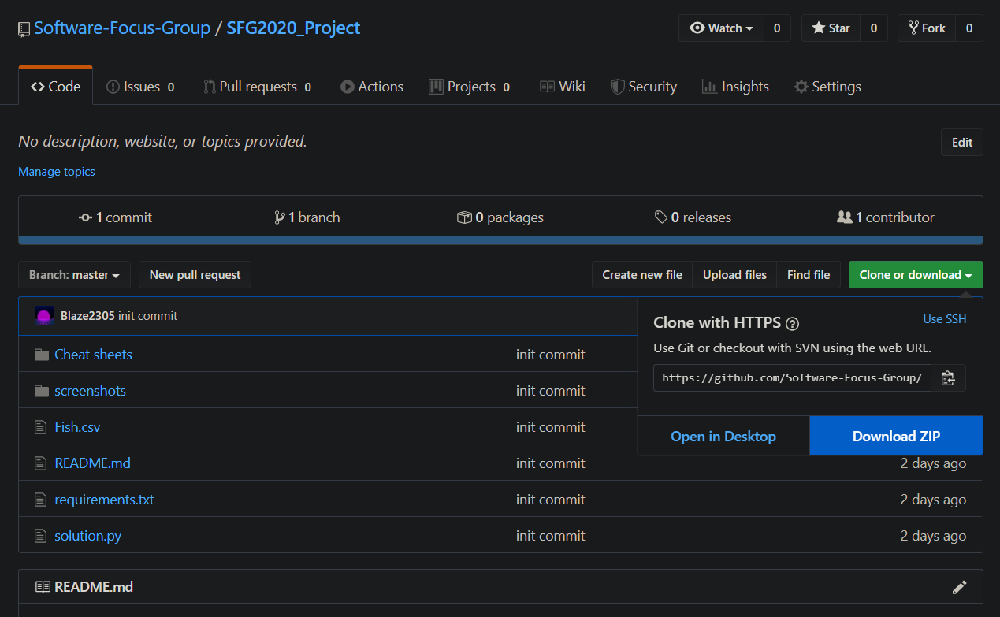
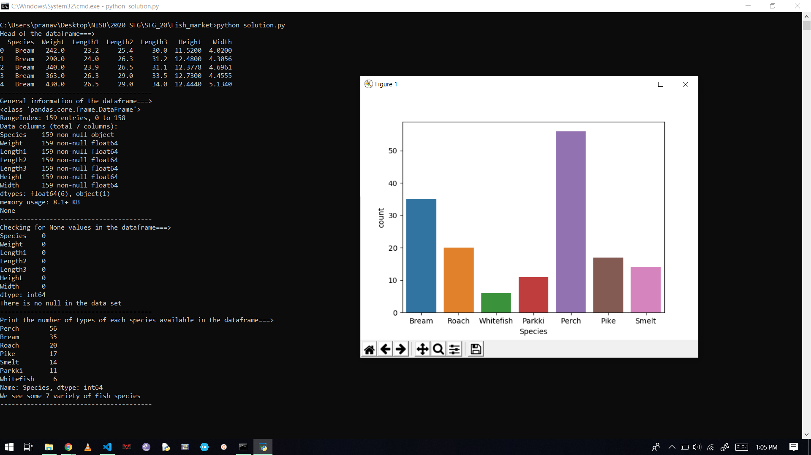
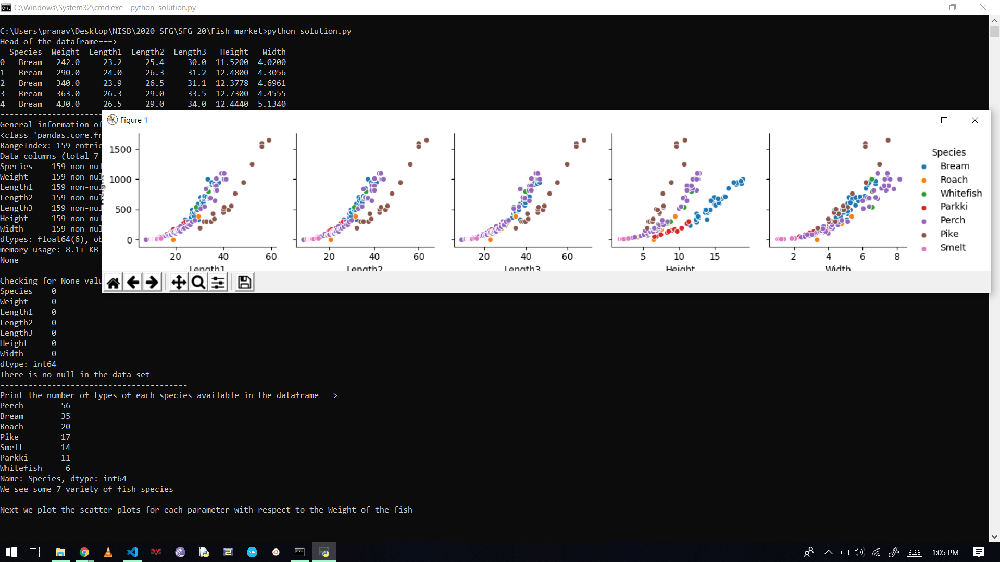
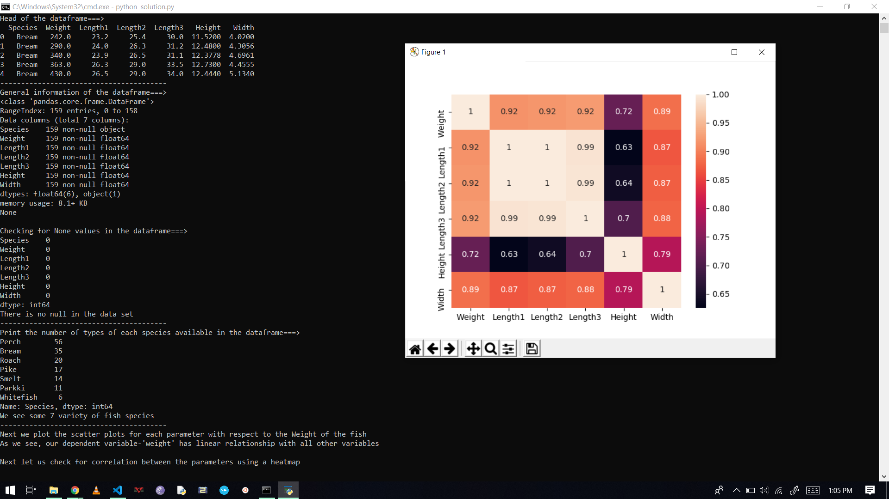

## SFG Project
###### This is the repository for a small data science project for SFG 2020 
#
#
###### Download the repository
- Manual download:
    
- git CLI:
     ```bash
        git clone https://github.com/Software-Focus-Group/SFG2020_Project

###### Run the code
- ```python
    pip install -r requirements.txt 
    python solution.py 
- The solution will be printed in the terminal and will often open up some plots and visualizations. Closing an opened graph will allow the code to continue further.
#
#
##### AIM :  
Fish Weight prediction 
#
#
##### How to approach a Data Science problem :
 1. **Define the problem**
    - First, it’s necessary to accurately define the data problem that is to be solved. The problem should be clear, concise, and measurable.

 2. **Decide on an approach**
    - There are many data science algorithms that can be applied to data, and they can be roughly grouped into the following families:

        - __Two-class classification__: useful for any question that has just two possible answers.
        - __Multi-class classification__: answers a question that has multiple possible answers.
        - __Anomaly detection__: identifies data points that are not normal.
        - __Regression__: gives a real-valued answer and is useful when looking for a number instead of a class or category.
        - __Multi-class classification as regression__: useful for questions that occur as rankings or comparisons.
        - __Two-class classification as regression__: useful for binary classification problems that can also be reformulated as regression.
        - __Clustering__: answer questions about how data is organized by seeking to separate out a data set into intuitive chunks
3. **Collect data**
    - It’s important to understand that collected data is seldom ready for analysis right away. Most data scientists spend much of their time on data cleaning, which includes removing missing values, identifying duplicate records, and correcting incorrect values.
4. **Analyze data**
    - The next step after data collection and cleanup is data analysis. At this stage, there’s a certain chance that the selected data science approach won’t work. This is to be expected and accounted for. Generally, it’s recommended to start with trying all the basic machine learning approaches as they have fewer parameters to alter.
5. **Interpret results**
    - After data analysis, it’s finally time to interpret the results. The most important thing to consider is whether the original problem has been solved. You might discover that your model is working but producing subpar results. One way how to deal with this is to add more data and keep retraining the model until satisfied with it.
#
#
##### Content [ Fish.csv ]:
This dataset is a record of 7 common different fish species in fish market sales. With this dataset, a predictive model can be performed using machine friendly data and estimate the weight of fish can be predicted.
#
#
### Columns : 
- Species :  species name of fish
- Weight : weight of fish in Gram g
- Length1 : vertical length in cm
- Length2 : diagonal length in cm
- Length3 : cross length in cm
- Height : height in cm
- Width : diagonal width in cm
#
#
### Example Screenshots :
-  
-  
-  
#
#
### Important Links: 
- [Scikit Learn user guide](https://scikit-learn.org/stable/user_guide.html)
- [Numpu documentation and user guide](https://numpy.org/devdocs/user/index.html)
- [Matplotlib.pyplot documentation and user guide](https://numpy.org/devdocs/user/index.html)
- [Seaborn reference](https://seaborn.pydata.org/api.html)
- [Simple and Multiple Linear regression in Python](https://towardsdatascience.com/simple-and-multiple-linear-regression-in-python-c928425168f9)
- [Beginners guide to Linear Regression](https://towardsdatascience.com/a-beginners-guide-to-linear-regression-in-python-with-scikit-learn-83a8f7ae2b4f)
- [How to think like a data scientist](https://medium.com/cracking-the-data-science-interview/how-to-think-like-a-data-scientist-in-12-steps-157ea8ad5da8)
